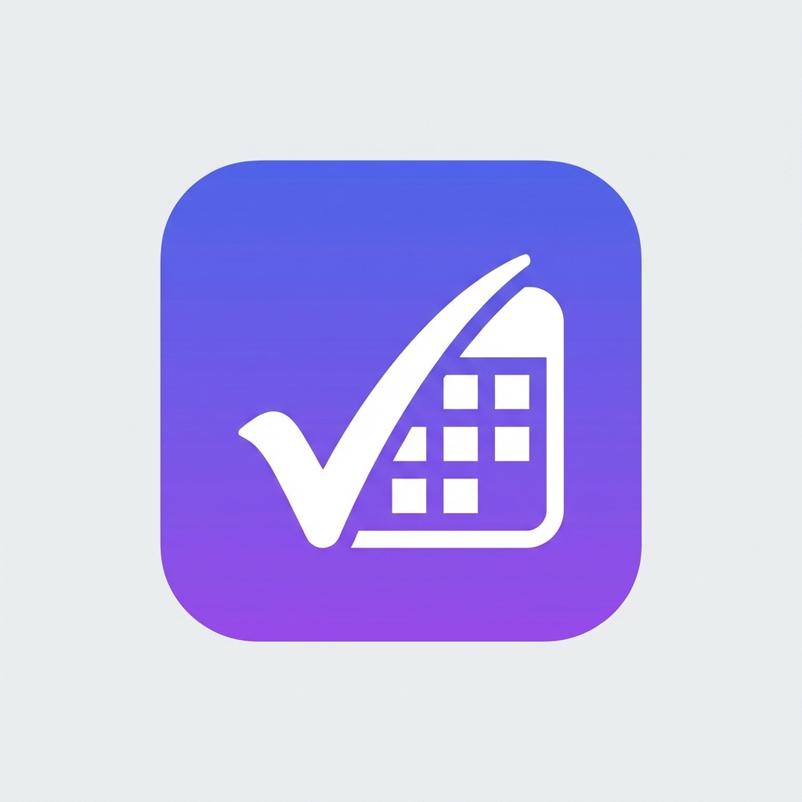

# AttendEase - Personal Weekly Attendance Tracker

AttendEase is a modern, mobile-first web application designed to help students track their weekly attendance, manage their timetables, and keep an eye on their academic schedule. Built with a focus on simplicity and a premium user experience, it functions seamlessly as a Progressive Web App (PWA) on Android and iOS devices.



## 🚀 Features

### 📅 Weekly Timetable Management
- **Visual Timetable**: Easy-to-read weekly view of your classes.
- **Merge/Split Slots**: Flexible slot management for labs or long lectures.
- **Quick Edits**: Tap to edit, drag to reschedule (planned).

### 📊 Attendance Tracking
- **Smart Dashboard**: Real-time view of your attendance percentage per subject.
- **Goal Tracking**: See how many classes you can skip or need to attend to maintain your target (e.g., 75%).
- **History**: Detailed log of your attendance history.

### 🛠️ Schedule Management
- **Holiday Manager**: Add and track improved holidays.
- **Extra Classes**: Schedule and track extra classes outside your regular timetable.
- **Cancellations**: Mark classes as cancelled to adjust your attendance stats accuracy.
- **Semester Breaks**: Define break periods to pause tracking.

### 📱 PWA & Mobile Optimized
- **Offline Support**: Full offline functionality for viewing your schedule and stats.
- **Installable**: Add to your home screen for a native app experience.
- **Mobile First Design**: Bottom navigation and touch-friendly interface on mobile, full desktop view on larger screens.

## 🛠️ Tech Stack

- **Framework**: [Next.js 15](https://nextjs.org/) (App Router)
- **Language**: [TypeScript](https://www.typescriptlang.org/)
- **Styling**: [Tailwind CSS](https://tailwindcss.com/)
- **Icons**: [Lucide React](https://lucide.dev/)
- **Database**: [Firebase Firestore](https://firebase.google.com/products/firestore)
- **Hosting**: [Firebase Hosting](https://firebase.google.com/products/hosting)
- **deployment**: Static Export (`output: 'export'`)

## 📦 Installation & Local Development

1. **Clone the repository**
   ```bash
   git clone https://github.com/yourusername/attendease.git
   cd attendease
   ```

2. **Install dependencies**
   ```bash
   npm install
   ```

3. **Set up Firebase**
   - Create a project in the [Firebase Console](https://console.firebase.google.com/).
   - Add a Web App and copy the config.
   - Create a `.env.local` file (or update `src/firebase/config.ts` if managing manually) with your keys.

4. **Run the development server**
   ```bash
   npm run dev
   ```
   Open [http://localhost:3000](http://localhost:3000) with your browser.

## 🚀 Deployment

The app is configured for **Firebase Hosting**.

1. **Build the project**
   ```bash
   npm run build
   ```

2. **Deploy**
   ```bash
   firebase deploy --only hosting
   ```

## 📱 PWA Installation

To install AttendEase on your Android device:
1. Open the deployed URL in Chrome.
2. Tap the **Menu** (three dots).
3. Select **"Add to Home screen"** or **"Install app"**.

## 📄 License

This project is licensed under the MIT License.
